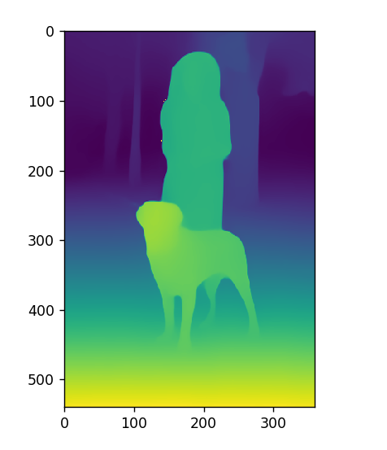

# Image-Depth-Estimation-Using-Depth-Prediction

### Introduction

    Image depth estimation is about figuring out how far away objects in an image are. 
    It’s an important problem in computer vision because it helps with things like creating 3D models, 
    augmented reality, and self-driving cars. In the past, people used techniques like stereo vision or special sensors 
    to estimate depth. But now, there’s a new method called Depth Prediction Transformers (DPTs) that uses deep learning.

    DPTs are a type of model that can learn to estimate depth by looking at images.

